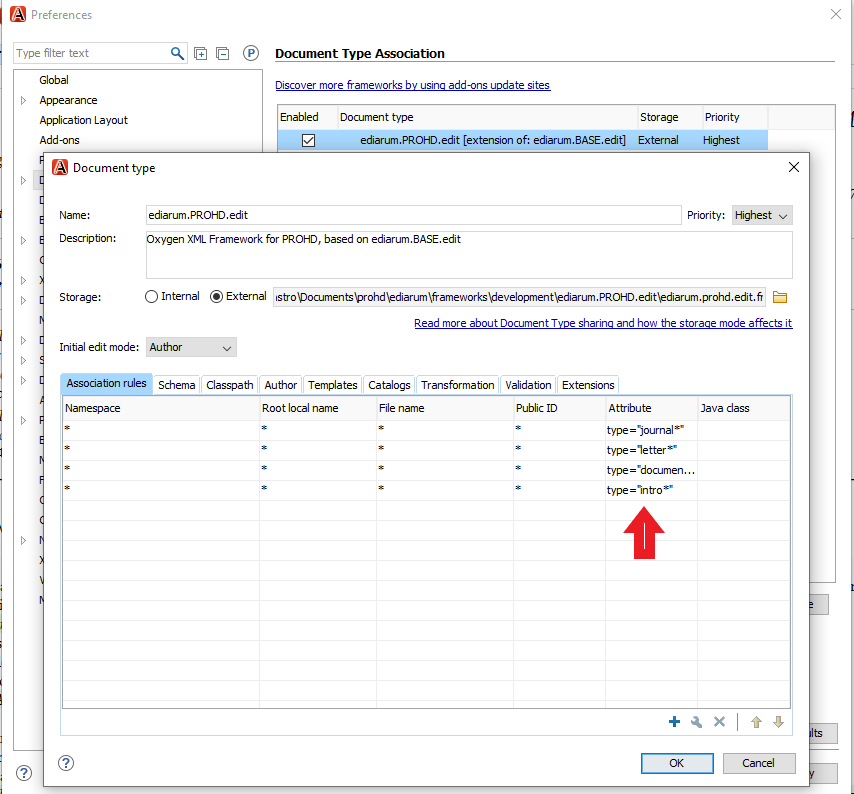
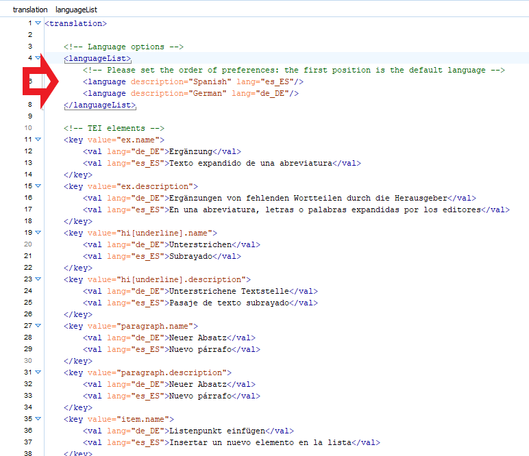

# Information about the framework

- This repository contains the latest public version of the *framework* for editing Humboldt Digital Project (ProHD).
- Oxygen XML editor *framework* based on [ediarum.BASE.edit](https://www.ediarum.org/).
- Development and localisation into Spanish by Antonio Rojas Castro.
- Contact: antonio.rojas-castro[at]bbaw.de

## Installation

- To install ediarum.PROHD.edit follow the instructions in the [ediarum Set-UP](https://www.ediarum.org/docs/set-up/oxygen/tasks/t_speicherort_ediarumbase_festlegen.html); at this time, we do not yet have the ediarum.REGISTER *framework* available.
- During the installation process, the only relevant change with respect to ediarum.BASE.edit is the use of @type attributes (instead of @doctype). To display the CSS file correctly in Oxygen XML Author, check that the installation contains the @type attributes. 
1. Go to *Options* --> *Preferences* --> *Document Type Association*
2. Select the ediarum.PROHD.edit and click on the *Edit* button.
3. Check in *Association Rules* that the *Attribute* column value is *type*; if not, double-click and type *type* in the *Local Name* field. 
4. Click on *OK* and *Apply*. 

## Language

- To change the language of the Oxygen XML Author interface, simply go to *Options* --> *Preferences* --> *Global*. Currently, the Oxygen XML Author interface is available in 5 languages (Chinese, German, French, English, Dutch and Japanese). 
- Select *German*, if you wish to display the ediarum interface and menu in German. To display the ediarum menu in English, select the English language.
- Next, check that the *translation.xml* file located in the *i18n* directory of the *framework* ediarum.PROHD.edit has the *<language>* tag in the preferred order. If you want to display the ediarum menu in German, the *<language description="German" lang="de_DE"/>* tag must appear first. 

# Información sobre el framework

- Este repositorio contiene la última versión pública del *framework* de edición de Proyecto Humboldt Digital (ProHD).
- Oxygen XML editor *framework* basado en [ediarum.BASE.edit](https://www.ediarum.org/).
- Desarrollo y localización al español de Antonio Rojas Castro.
- Contacto: antonio.rojas-castro[at]bbaw.de

## Instalación

- Para instalar ediarum.PROHD.edit sigue las instrucciones del [Set-UP de ediarum](https://www.ediarum.org/docs/set-up/oxygen/tasks/t_speicherort_ediarumbase_festlegen.html); en estos momentos, no tenemos aún disponible el *framework* ediarum.REGISTER.
- Durante el proceso de instalación, el único cambio relevante respecto a ediarum.BASE.edit es el uso de atributos @type (en lugar de @doctype). Para visualizar correctamente, el fichero CSS en Oxygen XML Author, comprueba que la instalación contiene los atributos @type. 
1. Ve a *Options* --> *Preferences* --> Document Type Association
2. Selecciona el ediarum.PROHD.edit y clica en el botón *Edit*.
3. Comprueba en *Association Rules* que el valor de la columna *Attribute* es *type*; si no fuera así, haz doble clic y escribe *type* en el campo *Local Name*.
4. Haz click en *Ok* y luego en *Apply*. 

## Cambio de idioma

- Para cambiar el idioma de la interfaz de Oxygen XML Author, simplemente ve *Options* --> *Preferences* --> *Global*. Actualmente, la interfaz de Oxygen XML Author está disponible en 5 idiomas (chino, alemán, francés, inglés, holandés y japonés). 
- Selecciona *alemán*, si deseas visualizar la interfaz y el menú de ediarum en alemán. Para visualizar el menú de ediarum en español, en cambio, selecciona el idioma inglés.
- A continuacion, comprueba que en el fichero *translation.xml* situado en el directorio *i18n* del *framework* ediarum.PROHD.edit tiene la etiqueta *<language>* en el orden preferido. Si deseas visualizar el menú de ediarum en alemán, la etiqueta *<language description="German" lang="de_DE"/>* debe aparecer en primer lugar.  

# Infos zum Framework

- Dieses Repository enthält die neueste öffentliche Version des *Frameworks* zur Redaktion des Projekts Humboldt Digital (ProHD).
- Oxygen-XML-Editor *Framework* basierend auf [ediarum.BASE.edit](https://www.ediarum.org/).
- Entwicklung und Lokalisierung ins Spanische von Antonio Rojas Castro.
- Ansprechpartner: antonio.rojas-castro[at]bbaw.de

## Installation

- Zur Installation von ediarum.PROHD.edit folgen Sie den Hinweisen im [ediarum Set-UP](https://www.ediarum.org/docs/set-up/oxygen/tasks/t_speicherort_ediarumbase_festlegen.html); das *Framework* ediarum.REGISTER steht derzeit noch nicht zur Verfügung.
- Bei der Installation ist die einzige relevante Änderung in Bezug auf ediarum.BASE.edit die Verwendung von @type-Attributen (anstelle von @doctype). Um die CSS-Datei in Oxygen XML Author korrekt anzuzeigen, prüfen Sie, ob die Installation die @type-Attribute enthält. 
1. Gehen Sie zu *Optionen* --> *Einstellungen* --> *Dokumenttyp-Zuordnung*
2. Wählen Sie die ediarum.PROHD.edit und klicken Sie auf die Schaltfläche *Bearbeiten*.
3. Prüfen Sie unter *Verknüpfungsregeln*, dass der Wert der Spalte *Attribut* *type* ist; wenn nicht, doppelklicken Sie und geben Sie *type* in das Feld *Lokaler Name* ein. 
4. Klicken Sie auf *OK* und *Anwenden*. 

## Sprache ändern

- Um die Sprache der Oxygen XML Author-Oberfläche zu ändern, gehen Sie einfach zu *Optionen* --> *Einstellungen* --> *Global*. Derzeit ist die Oxygen XML Author-Oberfläche in 5 Sprachen verfügbar (Chinesisch, Deutsch, Französisch, Englisch, Niederländisch und Japanisch). 
- Wählen Sie *Deutsch*, wenn Sie die ediarum-Oberfläche und das Menü in deutscher Sprache anzeigen lassen möchten. Wählen Sie *Englisch*, wenn Sie das ediarum Menü in Englisch anzeigen lassen wollen.
- Prüfen Sie als nächstes, ob die Datei *translation.xml*, die sich im Verzeichnis *i18n* des *Frameworks* ediarum.PROHD.edit befindet, den Tag *<language>* in der gewünschten Reihenfolge enthält. Wenn Sie das ediarum-Menü in Deutsch anzeigen möchten, muss das Tag *<language description="German" lang="de_DE"/>* zuerst erscheinen. 

